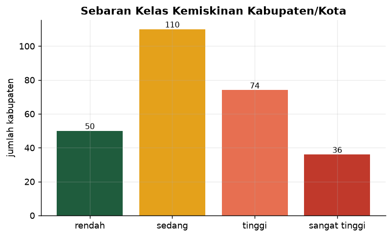
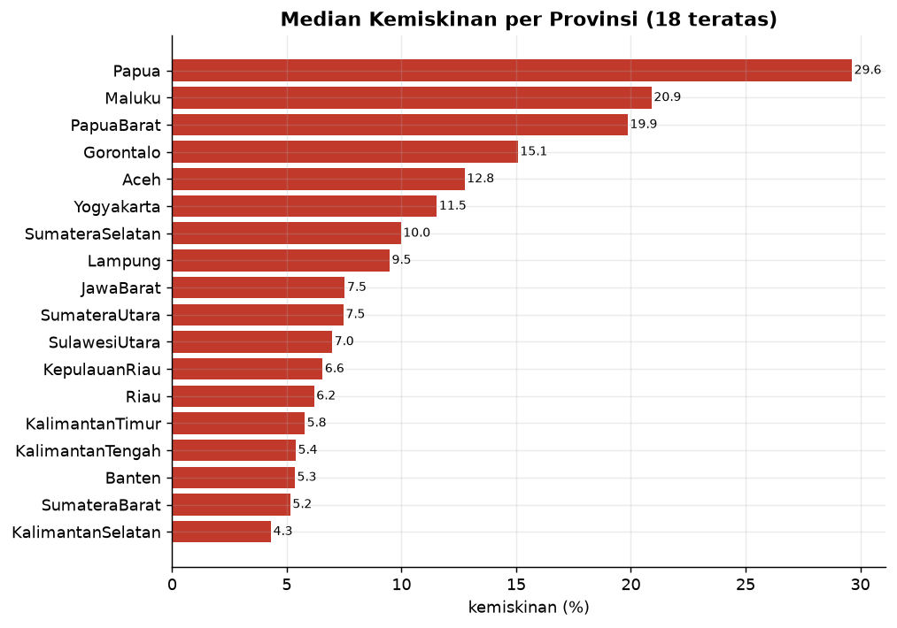
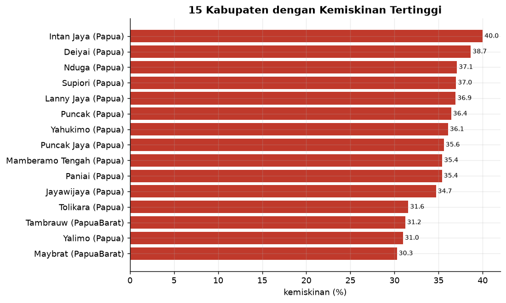
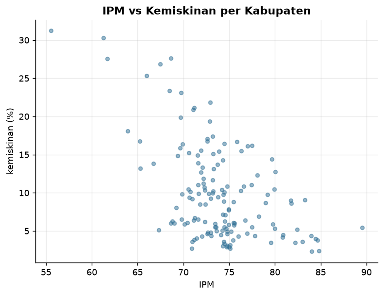

<div align="center">


### 🔗 [**Buka Peta Interaktif →**](https://geo-access-atlas.streamlit.app)

</div>

---

## 🗺️ Apa ini?

**Atlas geospasial kemiskinan & pembangunan Indonesia** — memetakan kemiskinan
dan IPM **per kabupaten/kota** dari data **resmi BPS (2020–2025)**, digabung
dengan batas wilayah GADM dan fasilitas OpenStreetMap.

Bukan sekadar peta: ini **pipeline data lengkap** (ingest → DuckDB → SQL marts →
peta + uji kualitas), dengan setiap elemen disertai narasi
**Kenapa · Tujuan · Dampak**.

```bash
python src/run_pipeline.py        # ingest BPS + GADM + OSM → marts
streamlit run app/dashboard.py    # buka peta interaktif
```

---

## 🏗️ Arsitektur

```
 BPS WebAPI ─┐   (kemiskinan, IPM 2020–2025)
 GADM 4.1 ───┼─► ingest_*.py ─► data/staging (Parquet + GeoJSON)
 OSM ────────┘        │
                      ▼
             load_db.py ─► DuckDB (staging + marts)
                      │
        sql/transform.sql (kanonikalisasi + join, SQL murni)
                      │
   ┌──────────────────┼───────────────────┐
   ▼                  ▼                   ▼
dashboard.py    make_charts.py   tests/test_data_quality.py
```

| Lapisan | File | Peran |
|---|---|---|
| **Ingest BPS** | `src/ingest_bps.py` | 34 domain × variabel → Parquet |
| **Ingest geo** | `src/ingest_geo.py` | GADM ADM2 + `CC_2` (kode BPS) |
| **Load** | `src/load_db.py`, `sql/schema.sql` | DuckDB |
| **Transform** | `sql/transform.sql` | kanonikalisasi + join + peringkat |
| **Quality** | `tests/test_data_quality.py` | 16 uji (unik, rentang, konsistensi) |
| **Narasi** | `src/explanations.py` | Kenapa·Tujuan·Dampak |
| **Peta** | `app/dashboard.py` | Folium choropleth + Streamlit |
| **Chart** | `src/make_charts.py` | PNG untuk README |
| **Orkestrasi** | `src/run_pipeline.py` | end-to-end |

---

## 📊 Data

| Aspek | Nilai |
|---|---|
| Sumber indikator | **BPS WebAPI** (resmi, 2020–2025) |
| Batas wilayah | **GADM 4.1** (502 kabupaten, join via `CC_2`) |
| Fasilitas | **OpenStreetMap** (Overpass: RS, sekolah, pasar) |
| Baris indikator | **17.000+** (142 variabel) |
| Cakupan peta | **270 kabupaten** terpetakan (dari 277 yg tersedia di BPS) |

**Indikator:** Persentase Penduduk Miskin (P0), Jumlah Penduduk Miskin,
Garis Kemiskinan, Indeks Pembangunan Manusia (IPM), Umur Harapan Hidup.

---

## 🔍 Temuan (dari pipeline ini)

1. **Kantong kemiskinan terkonsentrasi di Papua** — Intan Jaya (40.0%),
   Deiyai (38.7%), Nduga (37.1%) tertinggi nasional (2023).
2. **Ketimpangan antar-provinsi tajam** — dari ~2% (DKI/Bali, bila tersedia)
   hingga puluhan persen di Papua.
3. **Kanikalisasi diperlukan** — BPS memakai `var_id` berbeda tiap provinsi
   untuk konsep sama (temuan yang mengubah desain).
4. **Cakupan tidak 100%** — BPS tidak menyediakan kemiskinan di semua domain;
   GADM 4.1 belum memuat kabupaten pemekaran 2022+ (dilaporkan jujur).

---

## 📈 Visualisasi

### Sebaran kelas kemiskinan



> **Kenapa** — kategorisasi membuat situasi mudah dicerna.
> **Tujuan** — berapa banyak kabupaten di tiap tingkat keparahan?
> **Dampak** — mayoritas "tinggi/sangat tinggi" = masalah struktural.

### Median kemiskinan per provinsi



> **Kenapa** — provinsi adalah unit anggaran.
> **Tujuan** — menilai kesenjangan antar-provinsi.
> **Dampak** — dasar alokasi & benchmark antar-daerah.

### 15 kabupaten termiskin



> **Kenapa** — daftar prioritas konkret yang bisa ditindaklanjuti.
> **Tujuan** — menemukan target intervensi.
> **Dampak** — fokus sumber daya ke wilayah paling membutuhkan.

### IPM vs kemiskinan



> **Kenapa** — pendapatan & IPM mengukur pembangunan dari sisi berbeda.
> **Tujuan** — menguji apakah kabupaten miskin selalu ber-IPM rendah.
> **Dampak** — titik menyimpang menandakan kebutuhan program khusus.

---

## ⚠️ Keterbatasan yang diakui terbuka

- **Cakupan tidak penuh** — 270 kabupaten terpetakan. BPS hanya menyediakan
  variabel kemiskinan untuk **277 kabupaten** (bukan 514): banyak domain provinsi
  (DKI, Bali, Kep. Babel, Kaltara) tidak mempublikasikannya di WebAPI. Dari 277
  yang tersedia, **270 berhasil dipetakan (97%)** — 7 sisanya (mis. Pesisir
  Barat, Pangandaran) belum ada di GADM 4.1.
- **GADM 4.1 = 2022** — kabupaten pemekaran 2022+ (mis. Papua Selatan) belum
  ada → tidak terpetakan, **bukan dianggap nol**.
- **Kanikalisasi rapuh** — bergantung pada judul variabel BPS yang bisa berubah.
- **BPS butuh API key** — pipeline ingest tidak 100% jalan tanpa kredensial
  (dokumentasi `--no-ingest` disediakan). Kunci disimpan di `.env` (tidak di-commit).
- Data fasilitas OSM **tidak lengkap** (bergantung kontribusi relawan).

Lihat [`docs/ADR.md`](docs/ADR.md) untuk investigasi & keputusan lengkap.

---

## 🧪 Kualitas data

```
PASS  kode_bps unik
PASS  kemiskinan terisi di profil
PASS  IPM 0–100
PASS  band konsisten dgn ambang
PASS  pov referensial ke geometri
PASS  data segar (>= 2023)
...
[dq] SEMUA UJI LULUS
```

---

## 📁 Struktur

```
geo-access-atlas/
├── src/
│   ├── config.py             # path, sumber, API key dari .env
│   ├── ingest_bps.py         # BPS → staging
│   ├── ingest_geo.py         # GADM → staging
│   ├── load_db.py            # → DuckDB
│   ├── transform.py          # SQL marts
│   ├── explanations.py       # Kenapa·Tujuan·Dampak
│   ├── make_charts.py        # PNG README
│   └── run_pipeline.py       # orkestrator
├── sql/{schema,transform}.sql
├── tests/test_data_quality.py
├── app/dashboard.py          # peta Folium
├── docs/{ADR,ERD}.md
├── data/{staging,marts}/
├── db/                       # poverty.duckdb
└── reports/figures/          # PNG
```

---

## 🚀 Quick Start

```bash
pip install -r requirements.txt
cp .env.example .env          # isi BPS_API_KEY (daftar di webapi.bps.go.id)
python src/run_pipeline.py    # ingest penuh (~25 menit) + tests + charts
streamlit run app/dashboard.py
```

Tanpa ingest ulang (pakai staging yang ada):
```bash
python src/run_pipeline.py --no-ingest
```

---

## 🛠️ Tech Stack

| Layer | Teknologi |
|---|---|
| **Sumber** | BPS WebAPI · GADM 4.1 · OpenStreetMap (Overpass) |
| **Geo** | GeoPandas · Shapely · pyogrio |
| **Database** | DuckDB (embedded OLAP) |
| **Transform** | SQL murni (window functions, CTE) |
| **Peta** | Folium · streamlit-folium |
| **Dashboard** | Streamlit + Plotly |
| **Quality** | Uji kustom DuckDB |

---

## 👤 Author

<div align="center">

**Sandi Ridwan** — Data Analyst · Data Automation Engineer · Python

📍 Palu, Central Sulawesi, Indonesia

[](https://www.upwork.com/freelancers/~011f6d0fbb4a372974)
[](https://linkedin.com/in/sandi-ridwan)
[](https://github.com/SandiRidwan)

</div>

## 📄 License

MIT — Educational & portfolio. Data © BPS · GADM · OpenStreetMap (ODbL).
